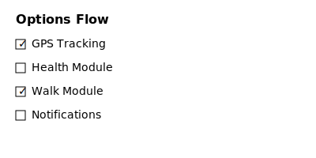

# Paw Control

**Die modulare Home Assistant Integration für Hunde(-Haushalte) mit Gassi, Gesundheit, GPS, Push und automatisch generierbarem Dashboard.**

---

## Features

- **Modular:** Wähle bei der Einrichtung, welche Funktionen du nutzen möchtest (Gassi, GPS, Push, Health, Dashboard).
- **Opt-in/Opt-out:** Jedes Modul ist jederzeit aktivierbar oder abschaltbar (auch nach dem Setup über Optionen).
- **Helper, Sensoren und Automationen werden automatisch bei Aktivierung erzeugt oder bei Deaktivierung entfernt.**
- **Fehlerresistent:** Kein Modul und kein Helper verschwindet durch Updates.
- **Blueprints & Mushroom-Karten für Lovelace direkt dabei.**
- **Optional: Automatisch generiertes Dashboard als YAML (Sensor).**

---

## Installation

1. Entpacke `custom_components/pawcontrol` in dein Home Assistant `custom_components`-Verzeichnis.
2. Starte Home Assistant neu.
3. Füge die Integration über die UI hinzu („Paw Control“).
4. Wähle bei der Einrichtung aus, welche Module du nutzen möchtest.
5. Über die **Optionen** der Integration kannst du später jedes Modul aktivieren oder deaktivieren.

### Module steuern

Während der Einrichtung und im Optionsdialog werden alle verfügbaren Module als Schalter angezeigt. Ein aktivierter Schalter richtet die zugehörigen Sensoren, Helper und Automationen ein; beim Deaktivieren werden sie wieder entfernt.

Der Teardown-Handler eines Moduls wird nur ausgeführt, wenn dieses in den Optionen ausdrücklich auf `Aus` gesetzt ist. Module, die standardmäßig deaktiviert sind und in den Optionen fehlen, werden dabei ignoriert.



Die Module lassen sich jederzeit über `Einstellungen → Geräte & Dienste → Paw Control → Optionen` anpassen.

---

## Beispielkarten (für Lovelace/Mushroom)

Kopiere diese YAML direkt in dein Dashboard:

### Letztes Gassi

```yaml
type: custom:mushroom-entity-card
entity: sensor.hund1_last_walk
name: Letztes Gassi
icon: mdi:walk
