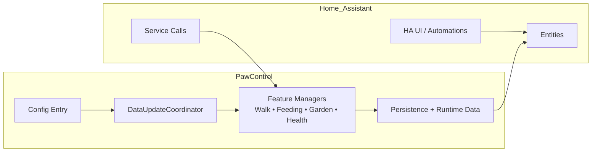
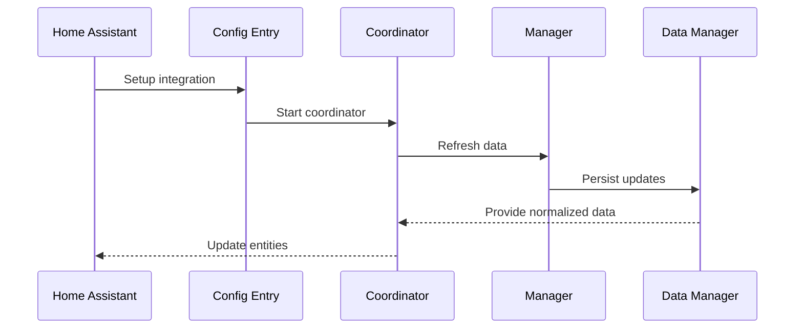

# Developer Guide (PawControl)

This guide covers **local development**, **testing**, and **troubleshooting** for
the PawControl Home Assistant integration. User-facing documentation lives in
`README.md` and the `docs/` folder.

## Local development setup

1. Create and activate a virtual environment:
   ```bash
   python -m venv .venv
   source .venv/bin/activate
   ```
2. Install dependencies:
   ```bash
   pip install -r requirements_test.txt
   pip install -r requirements.txt
   ```
3. Optional: install the project in editable mode for packaging hooks:
   ```bash
   pip install -e .
   ```

> **Note:** The repository ships local shims in `pytest_cov/` and
> `pytest_homeassistant_custom_component/`. Avoid installing the PyPI variants
> alongside this repo to prevent plugin conflicts.

## Running locally with Home Assistant

1. Copy the integration to your HA config:
   ```bash
   cp -r custom_components/pawcontrol /config/custom_components/
   ```
2. Restart Home Assistant.
3. Add the integration from **Settings → Devices & Services**.

## Architecture overview

## Flow modules

Home Assistant discovers flows via `custom_components/pawcontrol/config_flow.py`.
To keep import side effects low and make modularisation easier, the entry modules
are small shims and the full implementations live in:

- `custom_components/pawcontrol/config_flow_main.py` (config flow)
- `custom_components/pawcontrol/options_flow_main.py` (options flow)

Additional flow modules keep the main files manageable:

- `custom_components/pawcontrol/config_flow_discovery.py` (discovery steps: Zeroconf/DHCP/USB/Bluetooth)
- `custom_components/pawcontrol/config_flow_monitor.py` (timed operations + performance stats)
- `custom_components/pawcontrol/config_flow_placeholders.py` (description placeholders for forms)
- `custom_components/pawcontrol/config_flow_schemas.py` (schemas/constants used by the config flow)

When working on flows, edit the `*_main.py` modules and keep the shim modules
stable (they should only re-export the public flow classes).


PawControl follows the Home Assistant **config entry + coordinator** pattern.
High-level architecture:



### Runtime data flow



## Async & concurrency guidelines

- **Everything that touches HA must be async**: use `async def` and await on
  I/O, coordinator refreshes, or service handlers.
- **Never block the event loop**: wrap blocking work with
  `hass.async_add_executor_job`.
- **Centralize polling in the coordinator**: entities should read from
  coordinator data rather than calling APIs directly.
- **Avoid race conditions**: schedule changes via the data manager and reuse
  shared guards, rather than creating new background tasks.

## Typing guidelines

- Keep **strict typing** (`mypy` runs in strict mode). Avoid implicit
  optionals and untyped returns.
- Add new models to `types.py` and reuse existing type aliases.
- Use Home Assistant type aliases (`ConfigEntry`, `HomeAssistant`, `Platform`)
  consistently to keep annotations aligned with HA.

## Quality gate (run before PR)

```bash
ruff format
ruff check
python -m scripts.enforce_test_requirements
mypy custom_components/pawcontrol
pytest -q
python -m scripts.hassfest --integration-path custom_components/pawcontrol
python -m scripts.sync_contributor_guides
```

## Integration perfection checklist (Home Assistant aligned)

Use this checklist to keep improvements aligned with Home Assistant developer
guidelines while you iterate on new features or refactors:

- Keep all runtime state on `ConfigEntry.runtime_data` and reuse the coordinator
  + managers pattern. Avoid ad‑hoc background tasks or direct client calls from
  entities.
- Ensure every user‑facing string lives in `strings.json` and translations are
  synced across locales.
- Update diagnostics, docs, and tests together whenever a feature changes data
  payloads or service behavior.
- Validate all config/option flows with shared helpers and HA‑style error
  messages, including explicit min/max checks and unique‑ID guards.
- Ensure `extra_state_attributes` are JSON‑serializable and follow the
  normalization logic used for diagnostics.

## Localization workflow

Missing translation keys are a common cause of `hassfest` failures.

1. Add new user-facing strings to `custom_components/pawcontrol/strings.json`.
2. Propagate them to all locale files under
   `custom_components/pawcontrol/translations/`.
3. Re-run `python -m scripts.hassfest --integration-path custom_components/pawcontrol`
   to validate schema and localization.

## Testing strategy

Target **unit coverage for every entity type and flow**, including normal and
error paths:

- Config flow, options flow, and reauth scenarios
- Coordinator update failures and retry handling
- Service validation and side effects
- Diagnostics redaction
- Entity behavior for typical + failure paths (e.g., missing API token,
  invalid geofence coordinates, timeout handling)

Use `pytest` fixtures and the Home Assistant stubs in
`tests/helpers/homeassistant_test_stubs.py` to simulate core behavior without a
full HA runtime. Always exercise both successful and rejected paths by crafting
fixtures for missing API tokens, invalid geofence inputs, or timeout
conditions.

### Measuring coverage (without committing artifacts)

```bash
pytest -q --cov custom_components/pawcontrol --cov-report=term-missing
```

- Do **not** commit generated artifacts such as `.coverage*` or `htmlcov/`.
- Publish HTML coverage via CI artifacts or GitHub Pages instead.

## Troubleshooting

| Symptom | Likely cause | Fix |
| --- | --- | --- |
| `ImportError` for HA modules | Stubs not loaded or missing dependencies | Ensure tests call `install_homeassistant_stubs()` and requirements are installed. |
| `hassfest` failures | Missing keys in `strings.json` | Add new strings and sync `translations/*.json`. |
| `mypy` errors | Untyped returns/optionals | Update annotations; avoid implicit optionals. |
| `pytest` failures on coverage | Missing tests or uncovered error paths | Add unit tests for invalid inputs (e.g., geofence radius, missing API token). |

## Release checklist (dev-side)

- Update `CHANGELOG.md` with user-visible changes.
- Ensure new docs link to evidence (tests, diagnostics, workflows).
- Re-run the quality gate commands before tagging a release.
