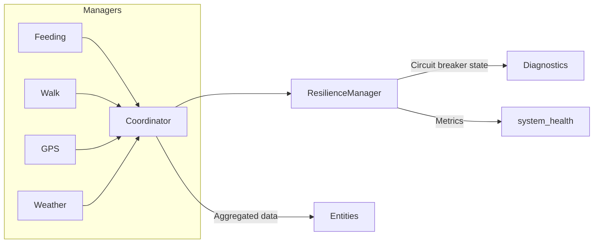

# Manager Layer Structure

The PawControl integration relies on a dedicated manager layer to keep the
`PawControlCoordinator` compact while still offering rich automation features.
The table below summarises each manager, the domain it owns, and the primary
interfaces.

| Manager | Domain | Key Responsibilities | Consumed By |
| --- | --- | --- | --- |
| `PawControlDataManager` | Persistence & caching | Normalises API payloads, stores long-lived context, provides quick lookups for dashboards. | Coordinator, diagnostics, dashboard templates |
| `FeedingManager` | Feeding schedules | Tracks feedings, calorie budgets, and health-aware meal plans. Exposes `async_get_feeding_data`. | Sensor, binary_sensor, number, select entities |
| `WalkManager` | Activity tracking | Aggregates walk telemetry, uptime, and fatigue thresholds. | Sensor, button, diagnostics |
| `PawControlNotificationManager` | Alerts & communication | Enforces quiet-hours, deduplicates alerts, integrates with HA notify services. | Services layer, resilience alerts |
| `GPSGeofenceManager` | Location safety | Maintains geofences, handles GPS outages, escalates via error catalogue. | Geofencing automations, diagnostics |
| `PawControlGeofencing` | Composite safety rules | Bridges GPS state with automation rules (e.g. yard mode vs. walk mode). | Automations, repairs |
| `WeatherHealthManager` | External context | Converts weather feed into health heuristics and risk scores. | Sensor, resilience warnings |
| `GardenManager` | Smart devices | Coordinates sprinklers & garden tracking for pet safety. | Switch, automation routines |

## Coordinator Integration

The coordinator acts as an orchestrator rather than a data owner:

1. `DogConfigRegistry` validates configuration and exposes helper methods such
   as `enabled_modules` and `empty_payload`.
2. `CoordinatorModuleAdapters` convert manager calls into async tasks with
   shared caching.
3. `CoordinatorRuntime` owns adaptive polling, resilience execution, and task
   concurrency. The class now lives in `coordinator_runtime.py`, keeping
   `coordinator.py` focussed on orchestration glue.
4. `CoordinatorMetrics` collects update telemetry, informing diagnostics and
   `system_health` callbacks.

Managers are attached via `PawControlCoordinator.attach_runtime_managers` during
entry setup. Each manager is optional; the adapters degrade gracefully and fall
back to the device API or sensible defaults when a manager is unavailable.

## Error Escalation Pipeline

All managers raise domain-specific exceptions (`ValidationError`,
`NetworkError`, `GPSUnavailableError`) which map directly to the
[`error_catalog.md`](error_catalog.md). The coordinator captures these and
feeds them into the resilience layer:

This separation keeps the coordinator implementation under 400 lines while the
runtime helper encapsulates adaptive polling, entity budget analysis, and
error handling without leaking complexity into entity code.
