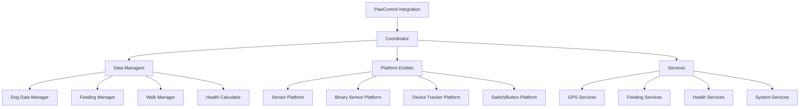

# 🐾 PawControl Integration - Production Documentation

**Environment:** Home Assistant 2025.9.1+ | Python 3.13+ | Quality Scale Platinum
**Integration Type:** Hub | IoT Class: Local Push | Version: 1.0.0

---

## 📖 Table of Contents

1. [Production Installation](#-production-installation)
2. [Architecture Overview](#-architecture-overview)
3. [Complete Configuration Reference](#-complete-configuration-reference)
4. [Platform & Entity Reference](#-platform--entity-reference)
5. [Service API Documentation](#-service-api-documentation)
6. [Event System](#-event-system)
7. [Dashboard Automation](#-dashboard-automation)
8. [Performance & Monitoring](#-performance--monitoring)
9. [Advanced Troubleshooting](#-advanced-troubleshooting)
10. [Developer API Reference](#-developer-api-reference)
11. [Production Deployment](#-production-deployment)
12. [Integration Ecosystem](#-integration-ecosystem)

---

## 🚀 Production Installation

### System Requirements

**Minimum Requirements:**
- Home Assistant Core 2025.9.1 or later
- Python 3.13+
- RAM: 512MB available
- Storage: 100MB free space
- Network: Stable internet for GPS updates

**Recommended Requirements:**
- Home Assistant OS or Supervised
- RAM: 1GB+ available
- Storage: 500MB+ free space
- SSD storage for performance
- Dedicated MQTT broker (optional)

### HACS Installation (Production)

```bash
# 1. Verify HACS installation
ls /config/custom_components/hacs/

# 2. Add PawControl repository
# HACS → Integrations → ⋮ → Custom repositories
# Repository: https://github.com/BigDaddy1990/pawcontrol
# Category: Integration

# 3. Install via HACS
# Search "PawControl" → Install → Restart HA

# 4. Verify installation
ls /config/custom_components/pawcontrol/
```

### Manual Installation (Advanced)

```bash
# Clone repository
cd /config/custom_components/
git clone https://github.com/BigDaddy1990/pawcontrol.git temp_pawcontrol

# Move integration files
mv temp_pawcontrol/custom_components/pawcontrol ./
rm -rf temp_pawcontrol

# Verify file structure
find pawcontrol/ -name "*.py" | head -10

# Set permissions (if needed)
chmod -R 644 pawcontrol/
chmod 755 pawcontrol/

# Restart Home Assistant
service home-assistant restart
```

### Integration Setup

```yaml
# Add integration via UI:
# Settings → Devices & Services → Add Integration → "PawControl"

# Or via configuration.yaml (advanced):
pawcontrol:
  # This triggers the configuration flow automatically
```

---

## 🏗️ Architecture Overview

### Core Components



### Module Architecture

| Module | Purpose | Dependencies | Performance |
|--------|---------|-------------|-------------|
| **Coordinator** | Central data coordination | All managers | High priority |
| **Cache Manager** | Performance optimization | LRU cache, TTL | Memory efficient |
| **Performance Manager** | Resource monitoring | System metrics | Background |
| **Batch Manager** | Efficient entity updates | Entity registry | Optimized |
| **Dashboard Generator** | Auto-dashboard creation | Lovelace API | On-demand |

### Data Flow

```yaml
# Standard data flow:
GPS Update → Coordinator → Cache → Entities → Frontend
     ↓
Service Call → Manager → Data Processing → State Update
     ↓
Event Firing → Automations → Actions
```

---

## ⚙️ Complete Configuration Reference

### Basic Configuration

```yaml
# Minimal setup (single dog)
pawcontrol:
  dogs:
    - dog_id: "buddy"
      dog_name: "Buddy"
      dog_breed: "Golden Retriever"
      dog_age: 3
      dog_weight: 25.5
      dog_size: "medium"
      modules:
        feeding: true
        walk: true
        health: true
        gps: true
        notifications: true
        dashboard: true
```

### Advanced Multi-Dog Configuration

```yaml
# Production multi-dog setup
pawcontrol:
  # Global settings
  dashboard_enabled: true
  dashboard_auto_create: true
  entity_profile: "standard"  # minimal, standard, comprehensive
  performance_mode: "balanced"  # minimal, balanced, full
  data_retention_days: 90

  # Individual dog configurations
  dogs:
    - dog_id: "buddy"
      dog_name: "Buddy"
      dog_breed: "Golden Retriever"
      dog_age: 3
      dog_weight: 25.5
      dog_size: "medium"
      dog_color: "golden"

      # Module enablement
      modules:
        feeding: true
        walk: true
        health: true
        gps: true
        notifications: true
        dashboard: true
        visitor: false
        grooming: true
        medication: true
        training: false

      # GPS configuration
      gps_source: "device_tracker"
      gps_update_interval: 60
      gps_accuracy_filter: 50
      gps_distance_filter: 10
      home_zone_radius: 100
      auto_walk_detection: true

      # Geofencing
      geofencing: true
      geofence_zones:
        - name: "Dog Park"
          latitude: 52.520008
          longitude: 13.404954
          radius: 50
          type: "safe_zone"
        - name: "Busy Street"
          latitude: 52.521008
          longitude: 13.405954
          radius: 20
          type: "restricted_area"

      # Feeding configuration
      feeding_times:
        breakfast_time: "07:30"
        dinner_time: "18:30"
      daily_food_amount: 300
      meals_per_day: 2
      food_type: "dry_food"
      special_diet: "grain_free"
      feeding_schedule_type: "flexible"
      portion_calculation: "auto"
      medication_with_meals: true

      # Health tracking
      health_tracking: true
      weight_tracking: true
      medication_reminders: true
      vet_reminders: true
      grooming_interval: 28

      # Notification settings
      notifications:
        enabled: true
        quiet_hours: true
        quiet_start: "22:00"
        quiet_end: "07:00"
        reminder_repeat_min: 30
        snooze_min: 15
        priority_notifications: true

        # Specific notification types
        walk_reminders: true
        feeding_reminders: true
        health_alerts: true
        geofence_alerts: true
        emergency_notifications: true

      # External integrations
      sources:
        door_sensor: "binary_sensor.front_door"
        person_entities:
          - "person.owner"
          - "person.family_member"
        device_trackers:
          - "device_tracker.owner_phone"
        calendar: "calendar.vet_appointments"
        weather: "weather.home"
        notify_fallback: "notify.mobile_app_phone"

    # Second dog with different configuration
    - dog_id: "luna"
      dog_name: "Luna"
      dog_breed: "Border Collie"
      dog_age: 2
      dog_weight: 18.0
      dog_size: "medium"

      modules:
        feeding: true
        walk: true
        health: false  # Disabled for Luna
        gps: true
        notifications: true
        dashboard: false  # Shared dashboard
        visitor: false

      # Simpler GPS configuration
      gps_source: "manual"
      gps_update_interval: 120
      auto_walk_detection: false
      geofencing: false

      # Different feeding schedule
      feeding_times:
        breakfast_time: "08:00"
        lunch_time: "13:00"
        dinner_time: "19:00"
      meals_per_day: 3
      daily_food_amount: 250
      food_type: "wet_food"
```

---

### Visitor Mode Workflow

1. **Aktivierung** – Besuchermodus per Service `pawcontrol.set_visitor_mode`
   oder über den generierten Switch/Button auslösen. Optional lassen sich Name
   des Besuchers sowie reduzierte Alarmprofile übergeben, die im
   `PawControlDataManager` persistiert werden.
2. **Statusüberwachung** – Die Binary-Sensoren und das Dashboard zeigen den
   aktiven Besuch sowie den Startzeitpunkt an; Benachrichtigungen folgen den im
   Options-Flow hinterlegten Quiet-Time-Regeln.
3. **Beenden & Nachverfolgung** – Die Dienste `toggle_visitor_mode` oder der
   Switch deaktivieren den Besuchermodus. Die Historie bleibt im Visitor-
   Namespace erhalten und kann für Audit- oder Automationszwecke abgefragt
   werden.

   **Dashboard-Komponenten**

   - *Visitor Controls Card* – Eine Entities-Karte bündelt den Switch
     `switch.{dog_id}_visitor_mode` und den Status-Binary-Sensor
     `binary_sensor.{dog_id}_visitor_mode`, wobei `_translated_visitor_label`
     automatisch Titel und Feldnamen an die aktive Home-Assistant-Sprache
     anpasst.【F:custom_components/pawcontrol/dashboard_cards.py†L133-L154】
   - *Visitor Insights Markdown* – Ein Markdown-Panel fasst Besuchername,
     Aktivierungszeitpunkt und das reduzierte Alarmprofil zusammen; die
     Template-Helfer `_translated_visitor_template` und
     `_translated_visitor_value` lokalisieren Überschrift sowie Ja/Nein- und
     Platzhaltertexte, damit Support-Teams dieselben Formulierungen wie im UI
     sehen.【F:custom_components/pawcontrol/dashboard_cards.py†L147-L176】【F:custom_components/pawcontrol/dashboard_cards.py†L1723-L1768】
   - *Regression Guard* – `test_generate_visitor_cards_localizes_german`
     stellt sicher, dass die deutsche Übersetzung der Karten dauerhaft stabil
     bleibt und Dokumentation sowie Dashboards synchron bleiben.【F:tests/unit/test_dashboard_templates.py†L1013-L1047】

### Service Execution Diagnostics

Support-Playbooks sollen bei jedem Dienstaufruf sowohl die Guard-Entscheidung
als auch die Widerstandsfähigkeitskennzahlen prüfen. PawControl speichert die
Breaker-Zusammenfassung unter `service_execution.rejection_metrics`, sobald
`_record_service_result` den Resilience-Snapshot des Koordinators ablegt, und
exportiert den Block unverändert in den Diagnostiken.【F:custom_components/pawcontrol/services.py†L414-L522】【F:custom_components/pawcontrol/diagnostics.py†L1004-L1036】

```yaml
service_execution:
  guard_metrics:
    executed: 4
    skipped: 1
  rejection_metrics:
    rejected_call_count: 2
    rejection_breaker_count: 1
    open_breakers:
      - "API Gateway"
    last_rejection_breaker_id: "api"
    last_rejection_time: "2023-11-14T09:13:20+00:00"
  last_service_result:
    service: notify.test
    status: error
    details:
      resilience:
        rejected_call_count: 2
        rejection_breaker_count: 1
```

Die Regressionen `test_record_service_result_merges_rejection_metrics` und
`test_record_service_result_defaults_rejection_metrics_without_breakers`
stellen sicher, dass abgelehnte und erfolgreiche Wiederherstellungsläufe die
gemeinsame Schema-Initialisierung respektieren und Diagnostiken stets die
aktuelle Momentaufnahme liefern.【F:tests/unit/test_services.py†L94-L161】【F:tests/unit/test_services.py†L162-L203】【F:tests/components/pawcontrol/test_diagnostics.py†L277-L307】

#### Resilience-Eskalationspanel
Neben `service_execution` exportiert der Diagnostics-Dump das Panel
`resilience_escalation`, damit Produktions-Runbooks die automatisch provisionierte
Eskalationslogik nachvollziehen können. Der Snapshot deckt Script-Entity, Guard-
und Breaker-Schwellen, Follow-up-Skript sowie Statistikquelle ab und spiegelt die
Defaults aus dem Script-Manager wider.【F:custom_components/pawcontrol/script_manager.py†L600-L940】【F:custom_components/pawcontrol/diagnostics.py†L180-L214】【F:tests/components/pawcontrol/test_diagnostics.py†L214-L247】

```json
{
  "entity_id": "script.pawcontrol_pack_resilience_escalation",
  "available": true,
  "thresholds": {
    "skip_threshold": {"default": 3, "active": 3},
    "breaker_threshold": {"default": 1, "active": 1}
  },
  "followup_script": {
    "default": "",
    "active": "",
    "configured": false
  },
  "statistics_entity_id": {
    "default": "sensor.pawcontrol_statistics",
    "active": "sensor.pawcontrol_statistics"
  },
  "escalation_service": {
    "default": "persistent_notification.create",
    "active": "persistent_notification.create"
  },
  "last_generated": "2024-02-20T09:15:00+00:00",
  "last_triggered": null
}
```

**Runbook-Hinweise:**

- Steigt `skip_threshold.active` über den projektierten Wert, dokumentiert das
  Panel eine bewusst gelockerte Guard-Eskalation und Runbooks sollten prüfen, ob
  zusätzliche Observability vorhanden ist.
- `breaker_threshold.active` von `0` deaktiviert Breaker-Alarme; Runbooks müssen
  in diesem Fall alternative Checks vorsehen.
- `followup_script.configured` zeigt, ob nachgelagerte Automationen (z. B.
  PagerDuty, Jira) verkettet sind und welche Entity für Eskalationen genutzt
  wird.【F:custom_components/pawcontrol/script_manager.py†L642-L720】
- Die Schwellenwerte lassen sich direkt über den Options-Flow (Schritt
  **Systemeinstellungen**) per `resilience_skip_threshold` und
  `resilience_breaker_threshold` pflegen; das Resilience-Skript, System-Health
  und die Diagnostics übernehmen die Einstellungen ohne zusätzliche YAML-
  Anpassungen.【F:custom_components/pawcontrol/options_flow.py†L1088-L1143】【F:tests/unit/test_options_flow.py†L804-L852】【F:custom_components/pawcontrol/system_health.py†L150-L356】
- `last_triggered` (UTC) ermöglicht ein Abgleichen mit Incident-Logs und den
  `service_execution`-Kennzahlen.
- Die System-Health-Kacheln übernehmen `skip_threshold.active` und
  `breaker_threshold.active`, markieren Guard- und Breaker-Indikatoren mit denselben
  Grenzwerten und dokumentieren Quelle sowie Fallbacks innerhalb von
  `service_execution.guard_summary.thresholds` beziehungsweise
  `service_execution.breaker_overview.thresholds`. Damit bleiben Dashboards und
  Runbooks synchron mit dem Eskalationsskript.【F:custom_components/pawcontrol/system_health.py†L150-L356】【F:tests/components/pawcontrol/test_system_health.py†L1-L210】
- Die Blueprint-Automation `pawcontrol/resilience_escalation_followup` ruft das
  Skript mit exakt diesen Schwellen auf, sobald Guard-Skip- oder Breaker-Zähler
  im Statistik-Sensor anschlagen. Zusätzlich lassen sich über
  `watchdog_interval_minutes`, `manual_check_event` sowie die neuen
  Ereigniseingaben `manual_guard_event` und `manual_breaker_event`
  zeitbasierte Watchdogs, kombinierte Checks oder getrennte Guard-/Breaker-
  Rechecks konfigurieren, ohne dass Runbooks zusätzliche Automationen für
  stagnierende Sensordaten erstellen müssen.【F:blueprints/automation/pawcontrol/resilience_escalation_followup.yaml†L1-L125】
- Diagnostics listen die aktiven `manual_*`-Trigger samt Blueprint-Quelle und
  übernehmen beim Setup vorhandene Script-Schwellen automatisch in die
  Optionsablage. Support-Dumps zeigen dadurch auf einen Blick, welche
  Eskalationspfade bereitstehen und ob Bestandsinstallationen bereits auf die
  neuen Resilience-Optionen migriert wurden.【F:custom_components/pawcontrol/script_manager.py†L238-L412】【F:custom_components/pawcontrol/options_flow.py†L700-L820】【F:tests/components/pawcontrol/test_diagnostics.py†L120-L208】

#### Troubleshooting-Playbook

Support-Teams können Guard- und Rejection-Daten gemeinsam auswerten, um
Fehlerbilder schnell einzugrenzen:

1. **Guard-Trend prüfen** – Die Guard-Zusammenfassung zählt erfolgreich
   ausgeführte sowie übersprungene Aktionen und listet Gründe für Blockaden auf.
   Steigt die Zahl der Übersprünge (`skipped`) pro Stunde über 3 oder tritt
   derselbe Grund mehrmals hintereinander auf, sollte der Incident an den
   Bereitschaftsdienst eskaliert werden, um etwaige Automationsloops zu
   verhindern.【F:custom_components/pawcontrol/services.py†L489-L519】【F:tests/components/pawcontrol/test_diagnostics.py†L277-L307】
2. **Breaker-Lage bewerten** – Offene Breaker und der letzte
   Ablehnungszeitpunkt (`last_rejection_time`) helfen dabei, gezielt auf API- oder
   Hardware-Probleme zu reagieren. Bleibt ein Breaker länger als fünf Minuten
   offen oder steigt der `rejected_call_count` kontinuierlich an, ist eine
   Eskalation an das Infrastruktur-Team erforderlich.【F:custom_components/pawcontrol/services.py†L437-L481】【F:tests/unit/test_services.py†L94-L203】
3. **Servicekontext sichern** – Diagnostikexporte speichern das letzte
   Serviceergebnis inklusive Guard-Detailblock und Metadaten. Diese Momentaufnahme
   sollte der Support beim Erstellen eines Tickets anhängen, damit Entwickler die
   gleiche Telemetrie wie das Dashboard sehen.【F:custom_components/pawcontrol/diagnostics.py†L1004-L1036】【F:tests/components/pawcontrol/test_diagnostics.py†L277-L307】

Die einzelnen Schritte kombinieren Guard-Zusammenfassungen und Breaker-Snapshots,
damit Support-Playbooks reproduzierbare Eskalationsschwellen für PawControl
bereitstellen.

---

## 🚀 Production Deployment

### Pre-Deployment Checklist

```yaml
# Production readiness checklist
deployment_checklist:

  # System Requirements
  system_requirements:
    - home_assistant_version: "≥2025.9.1"
    - python_version: "≥3.13"
    - available_memory: "≥512MB"
    - available_storage: "≥100MB"
    - network_connectivity: "stable"

  # Configuration Validation
  configuration:
    - config_validation: "passed"
    - dog_configurations: "validated"
    - module_dependencies: "satisfied"
    - external_integrations: "tested"
    - security_settings: "reviewed"

  # Performance Validation
  performance:
    - entity_count: "<500 per dog"
    - memory_usage: "<100MB"
    - update_frequency: "optimized"
    - cache_efficiency: ">70%"
    - response_times: "<2s"

  # Testing Requirements
  testing:
    - basic_functionality: "tested"
    - multi_dog_scenarios: "tested"
    - error_handling: "verified"
    - edge_cases: "covered"
    - integration_tests: "passed"

  # Security & Privacy
  security:
    - data_encryption: "enabled"
    - access_controls: "configured"
    - api_security: "validated"
    - privacy_settings: "reviewed"
    - backup_strategy: "defined"
```

### Production Configuration Templates

```yaml
# Optimized for performance and reliability
production_config:
  # Global settings
  entity_profile: "standard"  # Balance between features and performance
  performance_mode: "balanced"
  data_retention_days: 90

  # Cache optimization
  cache_settings:
    max_size: 2000
    ttl_seconds: 300
    enable_compression: true

  # Database optimization
  database_settings:
    connection_pool_size: 10
    query_timeout: 30
    enable_wal_mode: true

  # Update intervals (optimized)
  update_intervals:
    gps_update: 60  # seconds
    health_check: 300  # 5 minutes
    performance_metrics: 60
```

---

## 🌐 Integration Ecosystem

### Home Assistant Ecosystem

#### Core Integrations
```yaml
# Compatible Home Assistant integrations
core_integrations:

  # Person & Device Tracking
  person_tracking:
    - name: "Person Integration"
      purpose: "Link dog location to owner presence"
      entities: ["person.owner", "person.family_member"]

    - name: "Mobile App"
      purpose: "GPS source and notifications"
      features: ["location_tracking", "actionable_notifications", "widgets"]

    - name: "Life360"
      purpose: "Family location tracking"
      integration: "automatic"

  # Smart Home Devices
  smart_devices:
    - name: "Door/Window Sensors"
      purpose: "Automatic walk detection"
      devices: ["front_door", "back_door", "dog_door"]

    - name: "Smart Cameras"
      purpose: "Visual confirmation of dog activities"
      features: ["motion_detection", "person_detection", "pet_detection"]

    - name: "Smart Scales"
      purpose: "Automated weight tracking"
      integration: "api_based"

  # Environmental
  environmental:
    - name: "Weather Integration"
      purpose: "Weather-aware walk recommendations"
      data: ["temperature", "precipitation", "air_quality"]

    - name: "Sun Integration"
      purpose: "Daylight-based scheduling"
      features: ["sunrise", "sunset", "dawn", "dusk"]
```

---

## 📋 Production Checklist Summary

### ✅ Pre-Production Validation
- [ ] **System Requirements Met**: HA 2025.9.1+, Python 3.13+, 512MB+ RAM
- [ ] **Integration Installed**: Via HACS or manual installation
- [ ] **Configuration Validated**: All dog configs and modules verified
- [ ] **Entity Creation Tested**: All expected entities created successfully
- [ ] **Service Functionality**: All services tested and working
- [ ] **Dashboard Generated**: Auto-dashboard created and functional
- [ ] **Notification Testing**: All notification channels tested
- [ ] **Performance Baseline**: Metrics collected and within thresholds
- [ ] **Security Review**: Access controls and data protection verified
- [ ] **Backup Procedures**: Backup and recovery procedures tested

### ✅ Production Deployment
- [ ] **Monitoring Setup**: Performance and health monitoring active
- [ ] **Alert Configuration**: Critical alerts configured and tested
- [ ] **Documentation Complete**: All configurations documented
- [ ] **User Training**: End users trained on functionality
- [ ] **Support Procedures**: Support and troubleshooting procedures defined
- [ ] **Escalation Plan**: Incident response and escalation procedures ready

### ✅ Post-Deployment
- [ ] **Performance Monitoring**: Regular monitoring of key metrics
- [ ] **User Feedback**: Collect and address user feedback
- [ ] **Optimization**: Continuous performance optimization
- [ ] **Updates**: Regular integration updates and maintenance
- [ ] **Backup Verification**: Regular backup and recovery testing
- [ ] **Security Audits**: Periodic security reviews and updates

---

**🎉 PawControl Integration - Production Ready!**

*This comprehensive documentation provides everything needed for successful production deployment of the PawControl integration. For additional support, consult the troubleshooting section or contact the development team.*

**Version**: 1.0.0 | **Quality Scale**: Platinum | **Production Ready**: ✅

---
